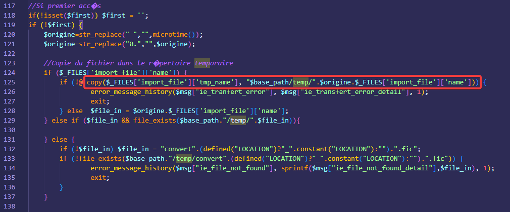

# PMB <=7.5.3 - Remote Code Execution via Unrestricted File Upload
**CVE-2023-46474**

| CVSS v3.1 Vector | CVSS v3.1 Score  |
|------------------|------------------|
| AV:N/AC:L/PR:H/UI:N/S:C/C:H/I:H/A:H | 9.1 |

Découverte dans le cadre d'un test d'intrusion par Marcus Reynaud de [Devensys Cybersecurity](https://devensys.com)

### Description

Le script `pmb/admin/convert/start_import.php` est vulnérable à une faille de type [`Unrestricted File Upload`](https://owasp.org/www-community/vulnerabilities/Unrestricted_File_Upload), ce qui permet d'obtenir une execution de code arbitraire sur le serveur.

L'attaquant doit auparavant obtenir **l'accès administratif** à la platefrome pour utiliser à cette fonctionnalité.

Le script PHP ne vérifie pas l'extension du fichier qui est uploadé par l'utilisateur, et le stocke dans un répertoire accessible par le serveur web en conservant son extension. Ainsi, il est possible d'uploader un script PHP, puis de l'executer en visitant l'endroit où il a été uploadé.

### Reproduction

Il est possible de reproduire ce comportement de la manière suivante :

On envoie un fichier en `.php` qui contient le code que l'on veut executer sur le système. Ici, nous executrons la commande système `id`.

En observant la réponse, nous pouvons récupérer le nom du fichier tel qu'il vient être écrit sur le serveur.

Pour executer notre code, il suffit de visiter `/pmb/temp/[nom_du_fichier].php` avec un navigateur.

Le résultat de la commande est renvoyé par le serveur.

### Cause
La cause de cette vulnérabilité est le manque de contrôle sur le fichier avant de l'écrire sur le disque :

### Remediation
Pour remédier cette vulnérabilité, il faut implémenter un contrôle des extensions sur les fichiers uploadés par les utilisateurs.

Nous vous conseillons d'utiliser un système de whitelist, qui n'autorise que certaines extensions de fichier.

Vous pouvez également écrire le fichier sur le disque en ommetant l'extension (sachant qu'il s'agit d'un stockage temporaire.)

Il est aussi possible d'écrire le fichier dans un répertoire hors du scope du serveur web, ce qui rendrait le fichier inaccessible sur Internet, et le code ne pourrait pas être éxecuté.

Les versions `7.5.4` et superieures ne sont pas vulnérables, le script a été entièrement réécrit.